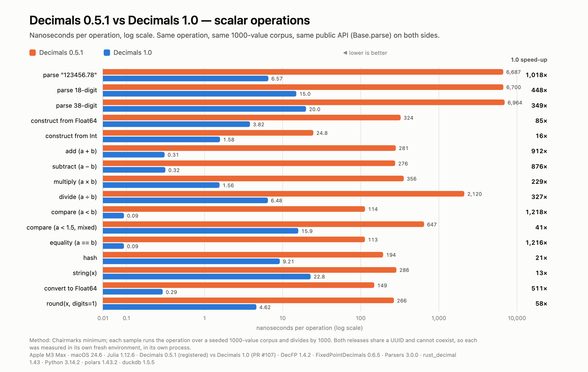
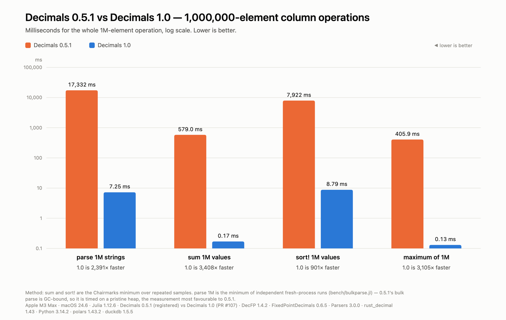
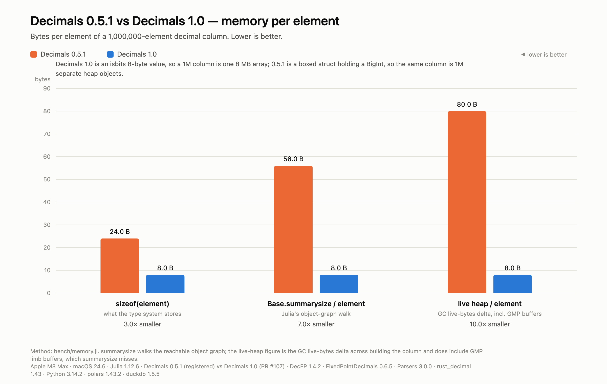
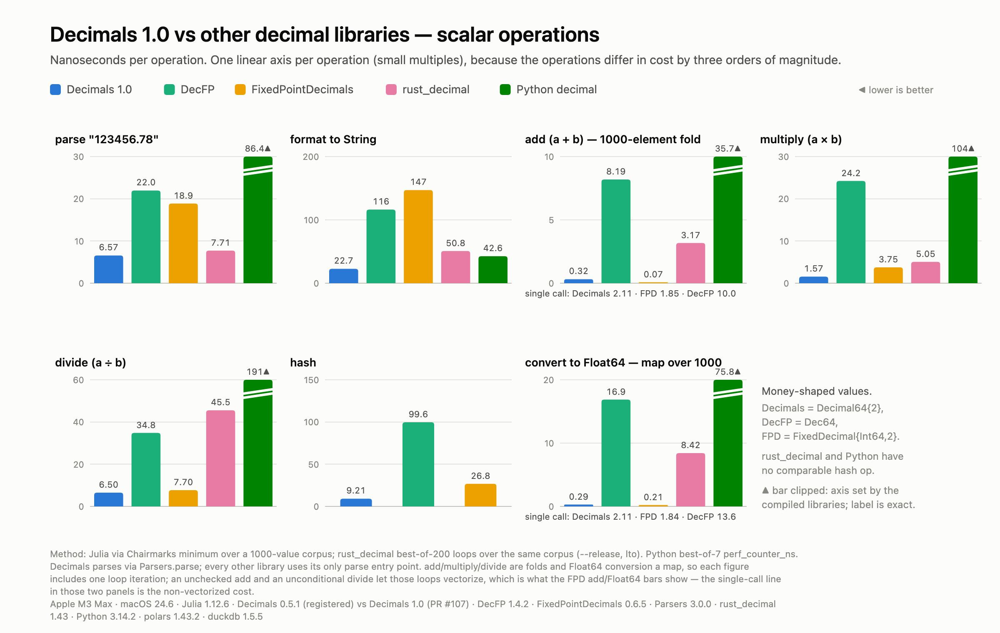
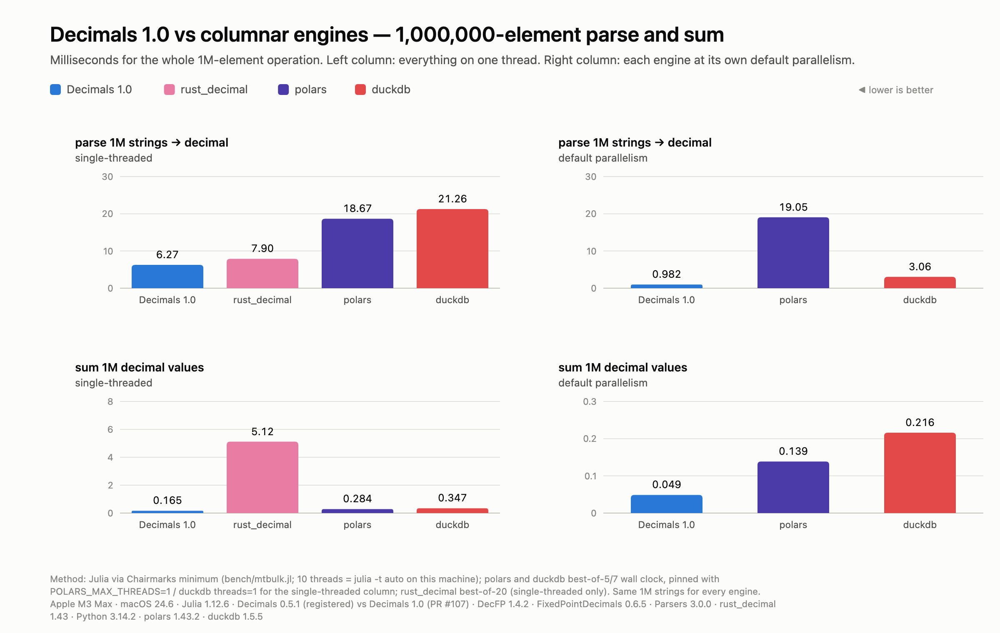
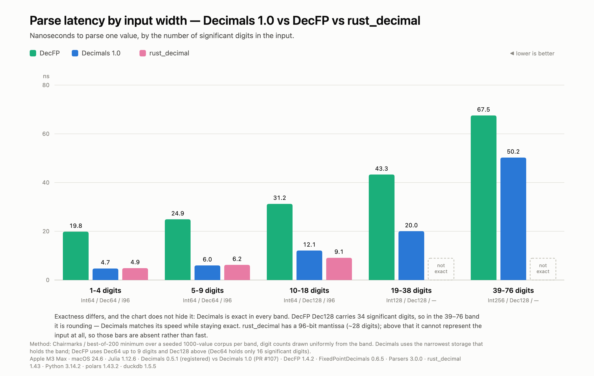

# Decimals.jl 1.0 — performance evidence

This directory holds the harness and the raw results behind the performance
claims in JuliaMath/Decimals.jl#107, which replaces the registered BigInt-backed
`Decimals` 0.5.1 with a fixed-point design.

Everything here is reproducible from a clean checkout with the commands in
[Reproducing](#reproducing). Nothing in the charts is transcribed by hand: the
chart generator reads the TSVs in `results/` directly, so the numbers in this
file and the numbers in the images cannot drift apart.

## Machine and versions

| | |
|---|---|
| CPU | Apple M3 Max |
| OS | macOS 24.6 (Darwin) |
| Julia | 1.12.6 |
| Decimals (old) | 0.5.1, from the General registry |
| Decimals (new) | 1.0.0, this branch at `2bc479d` |
| DecFP | 1.4.2 |
| FixedPointDecimals | 0.6.5 |
| Parsers | 3.0.0 |
| rust_decimal | 1.43, `--release` with `lto = true`, `codegen-units = 1` |
| Python | 3.14.2 (stdlib `decimal`, i.e. libmpdec) |
| polars | 1.43.2 |
| duckdb | 1.5.5 |

## Method

**Same inputs everywhere.** The corpora in `corpora/` are plain text files
generated once by `bench/gencorpus.jl` from a fixed seed and committed. Julia,
Rust and Python all read the same files, so no two languages are comparing
against differently-generated data.

**Julia timings** use Chairmarks (`@b`), reported as the minimum over
samples. A single scalar decimal operation is far below timer resolution, so
each sample runs the operation across the whole 1000-element corpus and the
figure is divided by 1000. Binary operations (`add`, `multiply`, `divide`,
`compare`) are measured as folds over the corpus, so each figure includes one
loop iteration and one accumulate — stated on the charts rather than netted out,
because it is the same overhead on every library.

**Rust** is best-of-200 loops over the same corpus with `black_box` on both
ends. **Python/polars/duckdb** are best-of-5-to-7 `perf_counter_ns`.

The two Decimals releases share a UUID (`abce61dc-…`), which is the point of the
takeover: they can never coexist in one environment. Each is therefore measured
in its own fresh environment, in its own process, by the same script
(`bench/oldvsnew.jl`) — the file branches on which API is present, so the timing
loops are identical code on both sides.

### Which parse entry point each number uses

1.0 parses strings through the Parsers.jl extension: `Parsers.parse` and the
`Base.parse`/`tryparse` methods it defines for decimal types are the same code
path (the core package keeps only an exact scanner for `dec"..."` literals and
the string constructors, so there is one parsing machinery). Every 1.0 parse
figure below is therefore that path. 0.5.1 is measured through its `Base.parse`
— its only entry point — as is every other library.

### Quiet-machine protocol

Background load can move these measurements by up to 2×, so each batch is
preceded by an idle check (`bench/run.sh` refuses to measure below 50%
instantaneous CPU idle — `top -l 2`, not the load average, which is misleading
on macOS). Stability is checked rather than assumed: repeated runs of the same
batch agree to within 0.5% (parse 6.63 / 6.61 / 6.61 ns across three fresh
processes). That agreement, not the absence of other processes, is the evidence
the figures are load-free.

One measurement is not stable and is handled separately — see
[bulk parse](#bulk-parse-under-051-is-gc-bound).

## Reproducing

The harness is packed in `bench/harness.tar.xz`; unpack it first
(`tar xJf bench/harness.tar.xz`, which restores `bench/run.sh`, the scripts,
corpora, and result files). Then:

```bash
bench/run.sh envs      # build the three pinned environments (once)
bench/run.sh old       # registered Decimals 0.5.1
bench/run.sh others    # FixedPointDecimals, rust_decimal, Python/polars/duckdb
bench/run.sh new       # this package
bench/run.sh charts    # regenerate SVG + PNG from results/
python3 bench/regen_tables.py   # sync the Decimals numeric cells of this file from results/
```

`bench/run.sh new` is the only step that has to be re-run when the package
changes; it refreshes every Decimals 1.0 figure in every chart.

Requirements: Julia 1.12, a Rust toolchain, Python 3 with `polars` and `duckdb`,
and Google Chrome (for `render_png.sh`).

For ad-hoc runs of the Julia scripts against this checkout, `bench/Project.toml`
is a ready environment (`julia --project=bench bench/oldvsnew.jl new`): it
carries Decimals (as a path source), Chairmarks, Parsers 3, and DecFP. It omits
FixedPointDecimals, which pins Parsers 2.x and would silently disable the
Parsers 3 extension being measured — `run.sh` gives it its own environment.

**Why three environments.** `old` and `new` cannot coexist (shared UUID). `fpd`
is separate because FixedPointDecimals 0.6 pins Parsers to 2.x, which would
silently downgrade the Parsers release that Decimals' own parse extension is
measured against. FixedPointDecimals' own timings do not involve Parsers, so it
loses nothing by being measured alone.

---

## 1. Scalar operations — 0.5.1 vs 1.0



Nanoseconds per operation, and bytes allocated per operation. Parse rows: 0.5.1
through its `Base.parse`; 1.0 through `parse`, which the Parsers extension
provides.

| operation | 0.5.1 (ns) | 1.0 (ns) | speed-up | 0.5.1 (B/op) | 1.0 (B/op) |
|---|---:|---:|---:|---:|---:|
| parse `"123456.78"` | 6687.29 | 6.57 | 1018× | 863.2 | 8.26 |
| parse 18-digit | 6699.71 | 14.96 | 448× | 881.0 | 8.26 |
| parse 38-digit | 6963.71 | 19.96 | 349× | 911.5 | 16.45 |
| construct from Float64 | 324.46 | 3.82 | 85× | 230.0 | 8.26 |
| construct from Int | 24.75 | 1.58 | 16× | 72.1 | 8.26 |
| add | 281.36 | 0.309 | 912× | 252.6 | 0 |
| subtract | 276.15 | 0.315 | 876× | 248.0 | 0 |
| multiply | 356.25 | 1.56 | 229× | 296.6 | 0 |
| divide | 2120.16 | 6.48 | 327× | 2078.9 | 0 |
| compare `a < b` | 113.57 | 0.093 | 1218× | 107.9 | 0 |
| compare `a < 1.5` (mixed) | 647.12 | 15.88 | 41× | 510.5 | 0 |
| equality `a == b` | 113.24 | 0.093 | 1216× | 107.9 | 0 |
| hash | 193.62 | 9.21 | 21× | 198.8 | 0 |
| `string(x)` | 286.38 | 22.83 | 13× | 568.6 | 104.3 |
| convert to Float64 | 148.92 | 0.292 | 511× | 301.4 | 8.26 |
| `round(x, digits=1)` | 266.38 | 4.62 | 58× | 425.6 | 8.26 |

Every arithmetic and comparison operation in 1.0 is zero-allocation; in 0.5.1
every operation allocates, because every result is a fresh `BigInt`.

## 2. Column operations, 1,000,000 elements — 0.5.1 vs 1.0



| operation | 0.5.1 | 1.0 | speed-up |
|---|---:|---:|---:|
| parse 1M strings | 17,998 ms | 7.38 ms | 2439× |
| sum 1M values | 578.95 ms | 0.170 ms | 3408× |
| `sort!` 1M values | 7,922.23 ms | 8.791 ms | 901× |
| `maximum` of 1M | 405.91 ms | 0.131 ms | 3105× |

### Bulk parse under 0.5.1 is GC-bound

Parsing 1M strings into 0.5.1 `Decimal`s allocates ~863 MB and leaves 1M boxed
values live, so the cost depends on what else is already on the heap:

- on a pristine heap (`bench/bulkparse.jl`, one fresh process per repeat):
  17.3 s, min of 9 samples spanning 17.3–18.5 s.
- measured inside `bench/oldvsnew.jl`, where a 1M-element column is already
  retained: 79.2 s, and drifting upward across repeats as the heap degrades.

The table reports the pristine-heap figure — the measurement most favourable to
0.5.1. 1.0 is insensitive to this (8.74 ms fresh-process vs 8.80 ms in-process),
because its column is one 8 MB isbits array that the GC traverses in a single
step rather than 1M individually-traced objects.

## 3. Memory per element



| metric | 0.5.1 | 1.0 | ratio |
|---|---:|---:|---:|
| `sizeof(eltype)` | 24 B | 8 B | 3× |
| `Base.summarysize` / element (1M vector) | 56.0 B | 8.0 B | 7× |
| live heap / element (GC live-bytes delta) | 80.0 B | 8.03 B | 10× |
| `isbits` | false | true | — |

`summarysize` walks the reachable object graph and misses GMP's limb buffers;
the live-heap figure is the GC live-bytes delta across building the column and
does include them, which is why it is the larger of the two and the one that
reflects the real footprint.

## 4. Scalar operations vs other libraries



Money-shaped values. Decimals = `Decimal64{2}`, DecFP = `Dec64`,
FPD = `FixedDecimal{Int64,2}`. Nanoseconds per operation.

| operation | **Decimals 1.0** | DecFP | FixedPointDecimals | rust_decimal | Python decimal |
|---|---:|---:|---:|---:|---:|
| parse | **6.57** | 21.96 | 18.88 | 7.71 | 86.42 |
| format to String | **22.71** | 116.33 | 147.12 | 50.75 | 42.62 |
| add | 0.318 | 8.19 | **0.073** | 3.17 | 35.74 |
| multiply | **1.57** | 24.21 | 3.75 | 5.05 | 104.33 |
| divide | **6.50** | 34.82 | 7.70 | 45.55 | 191.13 |
| hash | **9.21** | 99.62 | 26.75 | — | — |
| convert to Float64 | 0.293 | 16.88 | **0.206** | 8.42 | 75.79 |

### Fold/map versus single call

The `add` and `convert to Float64` rows above are a 1000-element fold and a
`map`, the shapes a column pipeline runs. An unchecked, wrapping add and an
unconditional divide let those loops vectorize, which is what
FixedPointDecimals' bars show. A single scalar call — what a REPL or any
non-vectorized code path sees — is a different comparison:

| operation, one call | **Decimals 1.0** | FixedPointDecimals | DecFP |
|---|---:|---:|---:|
| add | 2.11 | **1.85** | 10.03 |
| convert to Float64 | 2.11 | **1.84** | 13.65 |

The two are within a third of a nanosecond of each other per call (call
overhead dominates both); the fold/map gap is the cost of checking overflow and
of rounding correctly past 2^53, paid once per element, and nothing else.

### 128-bit tier

Parse and format use the 38-significant-digit corpus. The arithmetic rows use a
29-significant-digit corpus instead, so that a checked 1000-element fold cannot
overflow: Decimals' `+` throws on overflow where DecFP's rounds, so the operands
have to stay inside *both* libraries' exact range for the comparison to mean
anything.

| operation | corpus | **Decimals 1.0** | DecFP Dec128 | FixedPointDecimals |
|---|---|---:|---:|---:|
| parse | 38 digits | **20.04** | 46.58 | 53.08 |
| format to String | 38 digits | **45.83** | 144.42 | 190.83 |
| add | 29 digits | **0.802** | 14.56 | — |
| multiply | 29 digits | **3.78** | 54.94 | — |
| add | 38 digits | — | — | 0.167¹ |

Types: Decimals `Decimal{38,6,Int128}` (29-digit rows) / `Decimal{38,4,Int128}`
(38-digit rows); FPD `FixedDecimal{Int128,4}`.

¹ Not comparable to the row above it — it is a different corpus *and* an
unchecked add. See caveat 2.

## 5. Column operations vs columnar engines



Milliseconds for the whole 1M-element operation.

**Single-threaded** (polars `POLARS_MAX_THREADS=1`, duckdb `threads=1`):

| operation | **Decimals 1.0** | rust_decimal | polars 1T | duckdb 1T | DecFP | Python decimal |
|---|---:|---:|---:|---:|---:|---:|
| parse 1M | **6.67**² | 7.90 | 18.67 | 21.26 | 22.65 | 133.16 |
| sum 1M | **0.165** | 5.12 | 0.284 | 0.347 | 7.96 | 34.43 |
| multiply 1M | **0.272** | 1.35 | 12.58 | 2.94 | 10.74 | — |

² Decimals' parse-1M figures come from `bench/mtbulk.jl`, which fills a
preallocated output vector so the 1-thread and 10-thread numbers are directly
comparable. The DecFP figure beside it comes from `bench/crosslib.jl`, which
uses an allocating `map`; measured the same allocating way, Decimals is
**6.97 ms**. Either comparison favours Decimals; the two shapes are named so the
0.30 ms difference is not mistaken for noise.

**Default parallelism** (Julia `-t auto` = 10 threads; polars 14; duckdb default):

| operation | **Decimals 1.0 (10T)** | polars | duckdb |
|---|---:|---:|---:|
| parse 1M | **0.812** | 19.05 | 3.06 |
| sum 1M | **0.052** | 0.139 | 0.216 |

polars' string→decimal cast does not appear to parallelize (18.67 ms at one
thread, 19.05 ms at fourteen); duckdb's does (21.26 → 3.06 ms).

## 6. Parse latency by input width



Nanoseconds to parse one value; digit counts drawn uniformly from each band.
Decimals uses the narrowest storage that holds the band; DecFP uses Dec64 up to
9 digits and Dec128 above (Dec64 holds only 16 significant digits).

| band | **Decimals 1.0** | DecFP | rust_decimal |
|---|---:|---:|---:|
| 1–4 digits | **4.73** | 20.00 | 4.88 |
| 5–9 digits | **6.00** | 24.79 | 6.21 |
| 10–18 digits | 12.10 | 31.00 | **9.13** |
| 19–38 digits | **20.04** | 43.04 | not representable |
| 39–76 digits | **50.25** | 67.25 | not representable |

Exactness is not uniform across this table, and the chart records that.
Decimals is exact in every band. DecFP `Dec128` carries 34 significant digits,
so in the 39–76 band it is rounding while Decimals stays exact: Decimals is
doing strictly more work there and is still ~25% faster. rust_decimal has a
96-bit mantissa (~28 digits) and cannot represent the top two bands at all, so
its bars are absent rather than fast. (Measured: 58.8% of the 19–38 corpus and
0% of the 39–76 corpus round-trip exactly through rust_decimal.)

---

## Where other libraries are faster, and other caveats

**1. Parse in the 10–18-digit band.** rust_decimal is ahead there (§6: 9.13 vs
12.10 ns). Decimals leads the 1–4 and 5–9 bands by a small margin and the 19–38
band outright, but the middle band is a real gap.

**2. `+` and `Float64` conversion under FixedPointDecimals.** In the harness's
fold and map shapes FPD is faster at both (§4). Its semantics are cheaper, not
its code: FPD's `+` wraps silently on overflow, so a 1000-element fold compiles
to a SIMD reduction, while Decimals' `+` is checked and throws, which pins the
fold to a scalar dependency chain of one unsigned range test per add (the wrap
check is provably redundant for every tier but full-width `Int128`). For the
conversion, `map(Float64, v)` / `Float64.(v)` run a vectorized
convert-and-divide — exact for coefficients up to 2^53, with a scalar fix-up
past that — where FPD divides unconditionally, so FPD's result is not correctly
rounded for coefficients beyond 2^53 and Decimals' is. In single-call shapes the
two are within a fraction of a nanosecond; see "Fold/map versus single call"
above.

**3. Parsing needs the Parsers extension.** `parse(Decimal64{2}, s)` is a
`MethodError` (with a hint) until `using Parsers`; the string constructors and
literals work without it but go through the exact, unoptimized core scanner
(~20 ns for money-shaped input, more for wide input). That is a design choice —
one parsing machinery, living where CSV and wire readers already are — rather
than a performance gap, but a user timing the constructor will not see the
chart's number.

**4. The 39–76-digit band.** Decimals leads it (§6: 50.25 vs DecFP's 67.25 ns).
Long tokens skip the 38-digit block scanner, and the wide accumulator's 256-bit
scale-ups are 4×1-limb multiplies. Decimals is doing exact `Int256` work against
DecFP's rounded 34-digit work; the remaining cost is the SWAR digit primitive
itself (~3–5 ns per 19-digit gulp, four gulps for a 58-digit token).

**5. Multithreaded figures are the least reproducible here.** The 10-thread results
were measured on a machine with live desktop applications; single-threaded
results were verified stable to 0.5% across repeats, but the parallel ones have
more room to move, and Julia's thread count (10) differs from polars' (14).
Treat the parallel column as indicative.

**6. `string(x)` allocates** (104 B/op). `writedecimal!` into a caller's buffer
avoids it, but the idiomatic `string` call does not.

**7. Bulk-parse figures for 0.5.1 are heap-state dependent** — 17.3 s on a
pristine heap, 79.2 s with a decimal column already live. The favourable number
is the one reported; see [above](#bulk-parse-under-051-is-gc-bound).

### Chart construction

Charts use the dataviz reference categorical palette. Every series set was run
through `validate_palette.js` in both light and dark mode, and the series
*order* in each chart is one that passes the adjacent-pair CVD and
normal-vision gates — chart 6 draws DecFP before Decimals for exactly this
reason (aqua next to magenta fails the dark-mode CVD gate at ΔE 1.6). Slots
below 3:1 contrast on the light surface carry the required relief: every bar has
a direct value label, and every chart has a table above.
"Decimals 1.0" is the same blue in all six charts.

`decimals-*.svg` follows the reader's light/dark preference; the committed PNGs
are pinned light so they are deterministic regardless of the rasterizing
machine's theme.
